# 🚀 TATVA 2025 - Tech Fest Landing Page

<div align="center">


*A cutting-edge tech festival landing page with pure CSS animations and interactive features*

**🏆 Hackathon Team: TEAM BURI BURI**

</div>

---

## 🎯 **Project Overview**

**TATVA 2025** is a comprehensive tech festival landing page built with **pure HTML5 and CSS3** (no JavaScript dependencies). The project showcases modern web design principles with interactive CSS-only features, responsive design, and immersive user experience.

The landing page features a **dark theme aesthetic** with **orange and purple accent colors**, creating a futuristic tech festival atmosphere that appeals to developers, engineers, and tech enthusiasts.

---

## ✨ **Key Features**

### 🎨 **Design & User Experience**
- 🌟 **Pure CSS Animations** - Mandala loader, floating diyas, shimmer effects
- 🎭 **Festival Mode Toggle** - CSS-only theme switcher with warm festival colors
- 📱 **Fully Responsive** - Seamless experience across all devices
- 🎪 **Interactive Timeline** - CSS-only "Journey of TATVA" with :target selectors
- 🖼️ **Dynamic Gallery** - Responsive 2-column masonry layout

### 🚀 **Interactive Elements**
- 🪔 **Floating Diyas** - Auto-animated social media diyas with hover effects
- ⚡ **CSS-Only Toggles** - Festival mode and navigation without JavaScript
- 🎯 **Smooth Scrolling** - Enhanced navigation experience
- ✨ **Hover Effects** - Orange glow borders and scale animations

### 📋 **Content Sections**
- 🏠 **Hero Section** - Dynamic leaderboard preview with live stats
- 🎪 **Events Showcase** - Interactive event cards with hover animations
- 📅 **Venue & Date** - Interactive calendar with embedded maps
- 🏆 **Team Section** - 3D hover effects for team member cards
- 🎨 **Gallery** - Responsive image showcase with smooth transitions

---

## 🛠️ **Technologies Used**

| Technology | Purpose | Version |
|------------|---------|---------|
| **HTML5** | Semantic structure and accessibility | Latest |
| **CSS3** | Advanced styling and animations | Latest |
| **Google Fonts** | Typography (Orbitron, Rajdhani) | Latest |
| **Font Awesome** | Icons and social media symbols | 6.0.0 |
| **Unsplash API** | High-quality placeholder images | Latest |

---

## 🎨 **Design System**

### **Color Palette**
```css
Primary Orange: #e37119
Primary Purple: #8b5cf6
Background: #0a0a0a
Text: #e0e0e0
Accent Gold: #ffd700
```

### **Typography**
- **Headings**: Orbitron (Futuristic, tech-focused)
- **Body**: Orbitron (Consistent brand experience)
- **Sanskrit**: Noto Sans (Cultural authenticity)

---

## 🚀 **Unique Features**

### 🎪 **CSS-Only Interactive Timeline**
```css
.milestone:target {
    opacity: 1;
    transform: translateY(0);
    visibility: visible;
}
```
- Pure CSS interactivity using `:target` selectors
- Sanskrit headings with cultural authenticity
- Smooth transitions and golden glow effects

### 🪔 **Festival Mode Toggle**
```css
#fest-mode:checked ~ * {
    --festival-bg: linear-gradient(to bottom, #1a0f00, #2d1a08);
    --festival-glow: 0 0 15px rgba(255, 165, 0, 0.7);
}
```
- CSS-only theme switching
- Warm festival colors and animations
- Enhanced diya effects with flickering flames

### 🎭 **Floating Diyas Animation**
```css
@keyframes float-up {
    0% { transform: translateY(0) rotate(0deg); opacity: 0; }
    100% { transform: translateY(-100vh) rotate(360deg); opacity: 0; }
}
```
- Auto-floating social media diyas
- Hover-triggered floating animations
- CSS-only particle effects

---

## 📱 **Responsive Design**

| Breakpoint | Layout | Features |
|------------|--------|----------|
| **Desktop** (1280px+) | 3-column gallery, full navigation | All animations enabled |
| **Tablet** (768px-1279px) | 2-column gallery, condensed nav | Optimized touch targets |
| **Mobile** (320px-767px) | 1-column layout, hamburger menu | Simplified animations |

---

## 🎯 **Performance Optimizations**

- ⚡ **Zero JavaScript Dependencies** - Pure CSS animations
- 🖼️ **Optimized Images** - Responsive placeholders with proper sizing
- 🎨 **CSS-Only Effects** - Hardware-accelerated transforms
- 📱 **Mobile-First Design** - Progressive enhancement approach

---

## 🏆 **TEAM BURI BURI - Hackathon Team**

<div align="center">

### 👨‍💻 **Team Captain**
**Akash Anand** - Project Leadership & Overall Coordination

---

### 💻 **Coding & Design Team**
| Name | Role | Contribution |
|------|------|-------------|
| **Shivansh Ojha** | Prompt Developer | Frontend development & CSS animations |
| **Sirwagya Shekhar** | UI/UX Designer | User interface design & user experience |
| **Aditya Bahuguna** | Lead Developer | Fixed Bugs and wrote the code  |

---

### 🎨 **Presentation & Design Team**
| Name | Role | Contribution |
|------|------|-------------|
| **Divyansh Mewara** | Presentation Designer | Visual design & content presentation |
| **Aadi Shah** | Design Specialist | Graphics & visual elements |

</div>

---

## 🎯 **Team Structure Overview**

```mermaid
graph TD
    A[👨‍💻 Akash Anand<br/>Team Captain] --> B[💻 Coding & Design Team]
    A --> C[🎨 Presentation & Design Team]
    
    B --> D[Shivansh Ojha<br/>Lead Developer]
    B --> E[Sirwagya Shekhar<br/>UI/UX Designer]
    B --> F[Aditya Bahuguna<br/>Full-Stack Developer]
    
    C --> G[Divyansh Mewara<br/>Presentation Designer]
    C --> H[Aadi Shah<br/>Design Specialist]
    
    style A fill:#e37119,stroke:#fff,stroke-width:3px,color:#fff
    style B fill:#8b5cf6,stroke:#fff,stroke-width:2px,color:#fff
    style C fill:#ffd700,stroke:#fff,stroke-width:2px,color:#000
```

<div align="center">



</div>

---

## 🏅 **Hackathon Achievement**

<div align="center">

### 🎯 **Project Context**
This project was developed as part of a **competitive hackathon** where **TEAM BURI BURI** created a comprehensive tech festival landing page using **pure CSS animations** and **zero JavaScript dependencies**.

### 🏆 **Team Excellence**
- **⚡ Innovation**: Pure CSS-only interactive features
- **🎨 Design**: Modern, responsive UI/UX
- **🚀 Performance**: Optimized for all devices
- **💡 Creativity**: Unique festival mode toggle and floating diyas

### 🎪 **Key Achievements**
- ✅ **CSS-Only Timeline**: Interactive "Journey of TATVA" using `:target` selectors
- ✅ **Festival Mode**: CSS-only theme switching with warm colors
- ✅ **Floating Animations**: Auto-animated diyas with hover effects
- ✅ **Responsive Design**: Seamless experience across all devices
- ✅ **Cultural Integration**: Sanskrit headings and Indian festival aesthetics

</div>

---

## 🚀 **Getting Started**

### **Prerequisites**
- Modern web browser (Chrome, Firefox, Safari, Edge)
- No additional dependencies required

### **Installation**
```bash
# Clone the repository
git clone https://github.com/your-username/tatva-2025.git

# Navigate to the project directory
cd tatva-2025

# Open the landing page
open landing-page/Landing-page.html
```

### **Local Development**
```bash
# Serve the files locally (optional)
python -m http.server 8000
# or
npx serve .
```

---

## 🎨 **Customization**

### **Changing Colors**
```css
:root {
    --primary-orange: #e37119;
    --primary-purple: #8b5cf6;
    --background: #0a0a0a;
}
```

### **Adding New Events**
```html
<div class="event-card glass-effect">
    <div class="event-icon"><!-- SVG Icon --></div>
    <h3>EVENT NAME</h3>
    <p>Event description...</p>
</div>
```

---

## 📊 **Browser Support**

| Browser | Support | Notes |
|---------|---------|-------|
| **Chrome** | ✅ Full | All features supported |
| **Firefox** | ✅ Full | All features supported |
| **Safari** | ✅ Full | All features supported |
| **Edge** | ✅ Full | All features supported |
| **IE11** | ⚠️ Limited | Basic functionality only |

---

## 🤝 **Contributing**

We welcome contributions! Please follow these steps:

1. **Fork** the repository
2. **Create** a feature branch (`git checkout -b feature/amazing-feature`)
3. **Commit** your changes (`git commit -m 'Add amazing feature'`)
4. **Push** to the branch (`git push origin feature/amazing-feature`)
5. **Open** a Pull Request

---

## 📄 **License**

This project is licensed under the **MIT License** - see the [LICENSE](LICENSE) file for details.

---

## 📞 **Contact & Support**

<div align="center">

**TATVA 2025 Tech Fest**  
📍 Vedam School of Technology 
<!-- 📧 contact@tatva2025.com  
🌐 [tatva2025.com](https://tatva2025.com) -->

---

*Built with ❤️ by Team TATVA 2025*

</div>

